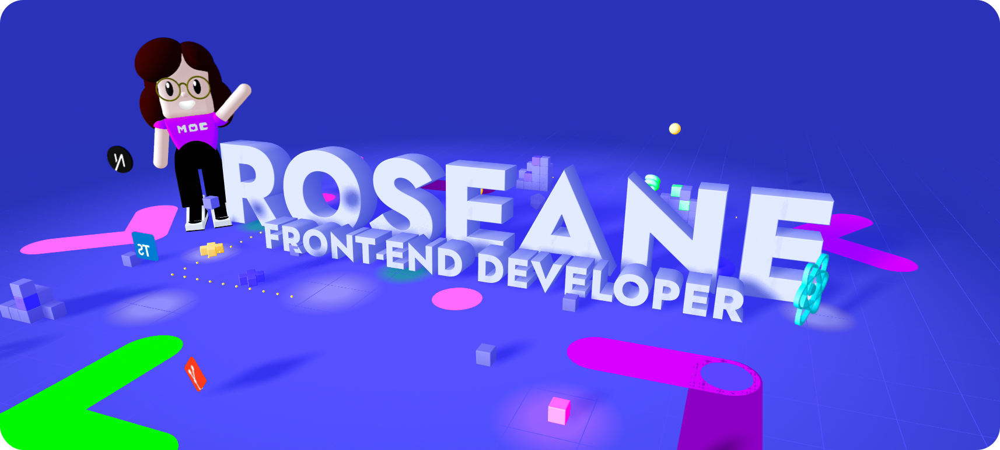

# 💫 About Me:

# Olá, eu sou a Roseane Nunes! 👋  Orgulhosamente **Pernambucana** ☀️ e apaixonada por transformar ideias em realidade. Atualmente, estou trilhando meu caminho como estudante de **Ciência da Computação**, focando em criar experiências digitais incríveis.  ---  ### 🚀 O que eu faço? * **Desenvolvedora Web:** Focada em tecnologias modernas como React, Next.js e Tailwind CSS. * **Assessora de Projetos na [Knex Consultoria Jr](https://github.com/knex-projects): Atuo na gestão e viabilização de soluções tecnológicas, unindo visão estratégica com execução técnica. * **Exploradora 3D:** Brincando com Spline para trazer profundidade ao desenvolvimento front-end.  --- 

## 🌐 Socials:
  

# 💻 Tech Stack:
               
# 📊 GitHub Stats:
 
 

<!-- Proudly created with GPRM ( https://gprm.itsvg.in ) -->
